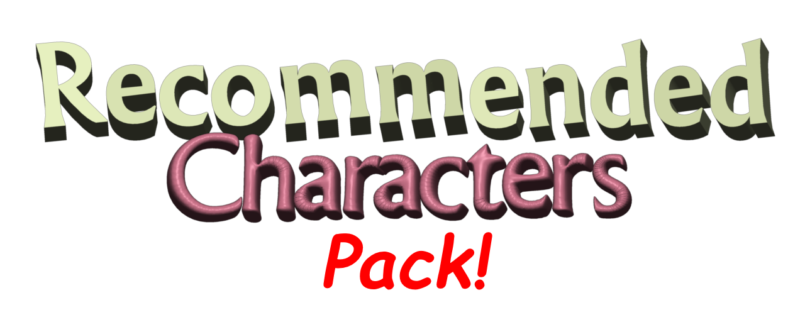

 
  

*aka "The WORST Baldi's Basics Mod I've Ever Played.." according to grays and land... (don't worry though, he just REALLY hates playtime)*

A decently sized and modular Baldi's Basics Plus mod that adds content with no rhyme or reason, usually requested by members in the Baldi GameBanana section and/or reinterpretations of characters from mods/fan games from the past.

# Licensing & Credits
Code is licensed under the [GNU General Public License v3](LICENSE).

Non-code assets:
- *Circle* assets ([Textures](Resources/io.github.uncertainluei.baldiplus.recommendedchars/Textures/Npc/Circle), [Audio](Resources/io.github.uncertainluei.baldiplus.recommendedchars/Audio/Circle)) and [*Nerf Gun* assets]((Resources/io.github.uncertainluei.baldiplus.recommendedchars/Textures/Item/NerfGun)) are property of [displ_ay](https://gamebanana.com/members/1698080), adjusted by [me (uncertain_luei)](https://github.com/uncertainluei) and [VerySugaryGoon](https://gamebanana.com/members/2720722) - proof of permission can be seen [here](Info/screenshot-display.png)
- *Gotta Bully* assets ([Textures](Resources/io.github.uncertainluei.baldiplus.recommendedchars/Textures/Npc/GottaBully), [Audio](Resources/io.github.uncertainluei.baldiplus.recommendedchars/Audio/GottaBully)), [*Swapped Closet* assets](Resources/io.github.uncertainluei.baldiplus.recommendedchars/Textures/Room/SwapCloset) and [*Arts with Wires* audio](Resources/io.github.uncertainluei.baldiplus.recommendedchars/Audio/ArtsWWires) originally edited by [Tapliasmy](https://gamebanana.com/members/1661542), adjusted by me (uncertain_luei) and VerySugaryGoon
- [*Arts with Wires* textures](Resources/io.github.uncertainluei.baldiplus.recommendedchars/Textures/Npc/ArtsWWires) made by [B-Side Skid](https://gamebanana.com/members/1879552), 1st Prize model by [saintza4](https://gamebanana.com/members/1657511)
- [*Man Meme Coin* sprites](Resources/io.github.uncertainluei.baldiplus.recommendedchars/Textures/Npc/MMCoin) originally made by [T40ne](https://www.curseforge.com/members/t40ne), adapted by me (uncertain_luei)
- [*CA April Fools* item textures:](Resources/io.github.uncertainluei.baldiplus.recommendedchars/Textures/Item/CAAprilFools)
  - *Flamin' Hot Cheepers* and *Can of Mangles* sprites by me (uncertain_luei)
  - *Cherry BSODA* textures by me (uncertain_luei), [base BSODA model](https://gamebanana.com/models/5037) by [MatejMakesStuff](https://gamebanana.com/members/2024162), original BSODA spray sprite by [Basically Games (mystman12)](https://basicallygames.com)
  - *Ultimate Apple* textures by me (uncertain_luei), original Apple assets by Basically Games (mystman12), based on the *Ultimate Apple* in Chaos Awakens.
- [*Mr. Daycare* sprites](Resources/io.github.uncertainluei.baldiplus.recommendedchars/Textures/Npc/Daycare) made by [MeltingRED3](https://gamebanana.com/members/1698319), adapted by [MoldyGangstaHero](https://gamebanana.com/members/2128693), me (uncertain_luei) and VerySugaryGoon
- [*Mr. Daycare* voicelines](Resources/io.github.uncertainluei.baldiplus.recommendedchars/Audio/Daycare) made by MoldyGangstaHero, except [`Day_NoLoudSound`](Resources/io.github.uncertainluei.baldiplus.recommendedchars/Audio/Daycare/Day_NoLoudSound) which was made by me (uncertain_luei)
- [*Daycare room* assets](Resources/io.github.uncertainluei.baldiplus.recommendedchars/Audio/Daycare) made by MoldyGangstaHero, adapted by me (uncertain_luei) and VerySugaryGoon
- [*Pie* and *Door Key* textures](Resources/io.github.uncertainluei.baldiplus.recommendedchars/Textures/Item/Daycare):
  - *Pie* texture made by MoldyGangstaHero, adapted by me (uncertain_luei)
  - *Pie* splat texture presumably made by [barribarrii](https://tenor.com/users/barribarrii), adjusted by me (uncertain_luei)
  - *Door Key* texture presumably made by VerySugaryGoon
- [*Eveyone's Bsodaa* and *Bsodaa Helper* textures] poorly recolored by [1n00bY7](https://gamebanana.com/mods/51775), adjusted by me (uncertain_luei) and VerySugaryGoon, old BSODA spray texture by Basically Games (mystman12)
- [*Eveyone's Bsodaa* and *Bsodaa Helper* audio] originally made by Basically Games (mystman12), edited by VerySugaryGoon using FakeYou
- [*Bsodaa room* assets] made by VerySugaryGoon, ceiling light by me (uncertain_luei)
- [*Diet BSODA Mini* textures] edited by me (uncertain_luei), original by Basically Games (mystman12)
- [Sound effects](Resources/io.github.uncertainluei.baldiplus.recommendedchars/Textures/Audio/Sfx):
  - *Daycare room* door and* Pie* throw sounds from *Dave's House* by MoldyGangstaHero
  - *Pie* splat sound effect uploaded by [NastyGooeySlimyFanboy on YouTube](https://www.youtube.com/watch?v=2FhsMJB0_fs)
  - *Cherry BSODA* boing sound effect from the Yorgurt Kingdom Discord server soundboard

# Dependencies

### Required:
- [BepInEx v5.4.23.x](https://github.com/BepInEx/BepInEx/releases)
- [Baldi's Basics Dev API](https://gamebanana.com/mods/383711)

### Optional:
- [Crispy+](https://gamebanana.com/mods/529314)
- [PineDebug](https://gamebanana.com/mods/542418)
- [Character Radar](https://gamebanana.com/mods/321209)
- [BB+ Custom Musics](https://gamebanana.com/mods/527812)
- [BB+ Animations](https://gamebanana.com/mods/503644)

# Build Instructions
This is for building the mod's .DLL and .PDB, which should be found at the `RecommendedChars/bin/Debug*/netstandard2.0/` directory.

\*`Release` if built with the *Release* configuration

### Functional Dependencies
This mod depends on the following mods to build:

- [Baldi's Basics Dev API](https://gamebanana.com/mods/383711)
- [PineDebug](https://gamebanana.com/mods/542418)
- [Character Radar](https://gamebanana.com/mods/321209)
- [BB+ Custom Musics](https://gamebanana.com/mods/527812)
- [BB+ Animations](https://gamebanana.com/mods/503644)

### Visual Studio 2022 (.NET)
Run `RecommendedChars.sln` in Visual Studio as a project. Building should then be as simple as going to **Build -> Build Solution** in the menu bar (or pressing Ctrl+Shift+B).

### Terminal
Make sure you have the [.NET SDK](https://dotnet.microsoft.com/en-us/download) installed. Open your terminal on the cloned/downloaded repository's directory, and execute:

`dotnet build .\RecommendedChars.sln`

This will build to the *Debug* configuration by default, append `-c Release` if you want to built it with the *Release* configuration.