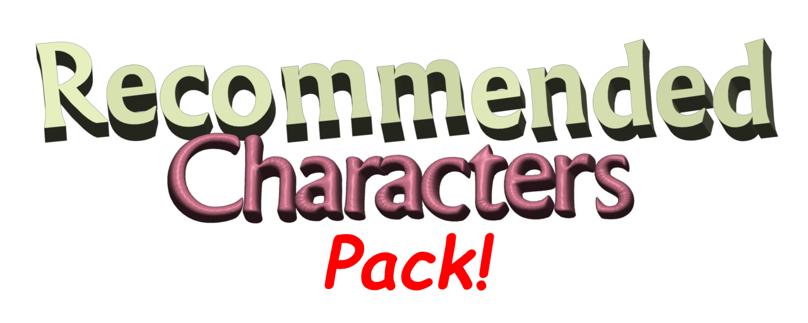

 
   

[**Download**](https://gamebanana.com/mods/591677) • [**Credits**](CREDITS.md)

*aka "The WORST Baldi's Basics Mod I've Ever Played.." according to grays and land... (don't worry though, he just REALLY hates playtime)*

A decently sized and modular Baldi's Basics Plus mod that adds content with no rhyme or reason, usually requested by members in the Baldi GameBanana section and/or reinterpretations of characters from mods/fan games from the past.

# Licensing and Credits
All code, unless stated otherwise, is licensed under the [GNU General Public License v3](LICENSE). Credits for other non-free assets can be seen [here](CREDITS.md).

# Dependencies

### Required to run (and build):
- [BepInEx v5.4.23.x](https://github.com/BepInEx/BepInEx/releases)
- [Caudex Lib v0.3](https://github.com/uncertainluei/CaudexLib)
- [Dev API](https://gamebanana.com/mods/383711)
- [Level Loader System](https://gamebanana.com/mods/617565)

### Fully optional:
- [Crispy+](https://gamebanana.com/mods/529314)
  
- ~~[Dev API Connector (required when running alongside ThinkerAPI mods)](https://github.com/AlexBW145/BaldiAPIConnector/releases)~~*
- ~~[Epic Entertainment Pack](https://gamebanana.com/mods/546336)~~*

### Functional (optional to run, required to build):
- [PineDebug](https://gamebanana.com/mods/542418)
- [Character Radar](https://gamebanana.com/mods/321209)
- [Advanced Edition](https://gamebanana.com/mods/504169)
- [Level Studio](https://gamebanana.com/mods/617567)
  
- ~~[Custom Musics](https://gamebanana.com/mods/527812)~~\*\*
- ~~[Animations](https://gamebanana.com/mods/503644)~~\*\*
- ~~Fragile Windows~~*
- ~~Eco Friendly~~*

\**Support for ThinkerAPI and its mods is halted until further notice.*
 
\*\*_Support will be brought back once PixelGuy's **True Plus Immersion Bundle** releases._

# Build Instructions
This is for building the mod's .DLL and .PDB, which should be found at the `Source/bin/Debug*/netstandard2.0/` directory.

\*`Release` if built with the *Release* configuration

### Visual Studio 2022 (.NET)
Run `RecommendedChars.sln` in Visual Studio as a project. Building should then be as simple as going to **Build -> Build Solution** in the menu bar (or pressing Ctrl+Shift+B).

### Terminal
Make sure you have the [.NET SDK](https://dotnet.microsoft.com/en-us/download) installed. Open your terminal on the cloned/downloaded repository's directory, and execute:

`dotnet build`

This will build to the *Debug* configuration by default, append `-c Release` if you want to built it with the *Release* configuration.
